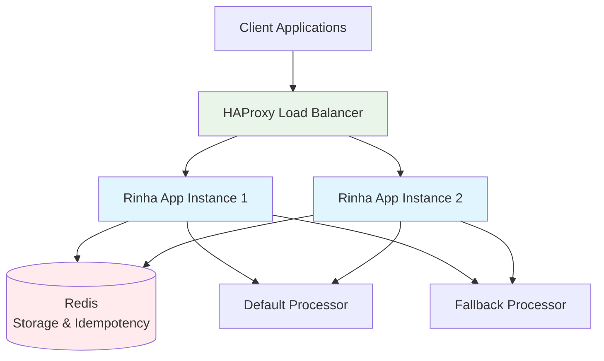

# Rinha de Backend 2025 - High-Performance Payment Processing API

**Java 21 Virtual Threads + Redis + GraalVM Native**

A minimal, high-performance, low-memory payment processing API implementation for the Rinha de Backend 2025 challenge. Built with Java 21 virtual threads, Spring Boot 3, Redis for storage and idempotency, circuit breaker pattern for external processors, and optimized for maximum profit with low p99 latency.


## 🚀 Features

- **Virtual Threads**: Native Java 21 virtual threads for handling thousands of concurrent requests efficiently
- **Idempotency**: Redis-based SETNX implementation preventing duplicate payment processing
- **Circuit Breaker**: Sliding window circuit breaker for external payment processors with automatic fallback
- **Low Latency**: Optimized for p99 latency with timeouts: 50ms connect, 80ms request
- **High Performance**: GraalVM native compilation for minimal memory footprint and fast startup
- **Load Balancing**: HAProxy configuration for distributing load across multiple instances
- **Monitoring**: Health endpoints and operational metrics

## 🏗️ Architecture



### Key Components

- **Payment Controller**: REST endpoints for `/payments` and `/payments-summary`
- **Circuit Breaker**: Prevents cascade failures with configurable thresholds
- **Payment Service**: Orchestrates payment processing with idempotency guarantees
- **HTTP Client**: Virtual thread-enabled client for external processor communication
- **Redis Integration**: Storage for payment aggregation and idempotency keys

## 📋 API Endpoints

### POST /payments
Process a payment with idempotency guarantee.

**Request:**
```json
{
  "correlationId": "123e4567-e89b-12d3-a456-426614174000",
  "amount": 123.45
}
```

**Response:** `200 OK` (empty body)

### GET /payments-summary
Get payment summary with optional time range filtering.

**Query Parameters:**
- `from` (optional): Start time (ISO8601 or epoch)
- `to` (optional): End time (ISO8601 or epoch)

**Response:**
```json
{
  "totalAmountDefault": "1234.56",
  "totalCountDefault": 42,
  "totalAmountFallback": "567.89",
  "totalCountFallback": 15,
  "interval": {
    "from": "2025-01-01T00:00:00Z",
    "to": "2025-01-01T23:59:59Z"
  }
}
```

### GET /actuator/health
Health check endpoint for load balancer.

## 🛠️ Quick Start

### Prerequisites
- Java 21 (GraalVM recommended for native builds)
- Docker & Docker Compose
- Make (optional)

### Using Make (Recommended)

```bash
# Build JVM version
make build-jvm

# Build native version
make build-native

# Build Docker images
make docker-native

# Start full infrastructure (Redis + HAProxy + Apps)
make up

# Run load tests
make load-test

# Stop infrastructure
make down

# Clean up
make clean
```

### Manual Commands

```bash
# Build application
./mvnw clean package -DskipTests

# Run with JVM
java -jar target/rinha.jar

# Build native image
./mvnw clean -Pnative native:compile

# Start infrastructure
docker-compose up -d

# Test API
./scripts/test-api.sh
```

## 🐳 Docker Deployment

The project includes optimized Docker configurations:

- **Dockerfile**: GraalVM native image (minimal size, fast startup)
- **Dockerfile.jvm**: JVM-based image (development/fallback)
- **docker-compose.yml**: Complete infrastructure setup

### Resource Limits
- **App instances**: 200MB RAM, 0.5 CPU each
- **Redis**: 300MB RAM, 0.5 CPU
- **HAProxy**: 50MB RAM, 0.2 CPU
- **Total**: ~750MB RAM, ~1.4 CPU for full setup

## ⚡ Performance Characteristics

### Circuit Breaker Configuration
- **Failure Threshold**: 3 consecutive failures
- **Open Duration**: 750ms
- **Half-Open Requests**: 2 test requests

### Timeout Configuration
- **Connect Timeout**: 50ms
- **Request Timeout**: 80ms
- **Health Check**: Every 5s (as per challenge rules)

### Virtual Threads Benefits
- Handles thousands of concurrent connections
- Minimal memory overhead per request
- No thread pool management overhead
- Natural backpressure handling

## 🔧 Configuration

### Environment Variables

```bash
# Redis Configuration
REDIS_HOST=localhost
REDIS_PORT=6379
REDIS_PASSWORD=

# External Processors
PROCESSOR_DEFAULT_URL=http://localhost:8081
PROCESSOR_FALLBACK_URL=http://localhost:8082

# Timeouts
PROCESSOR_CONNECT_TIMEOUT=50ms
PROCESSOR_REQUEST_TIMEOUT=80ms

# Circuit Breaker
CIRCUIT_BREAKER_FAILURE_THRESHOLD=3
CIRCUIT_BREAKER_OPEN_DURATION=750ms
CIRCUIT_BREAKER_HALF_OPEN_REQUESTS=2
```

### Application Properties

Key configurations in `application.properties`:

- Virtual threads enabled: `spring.threads.virtual.enabled=true`
- Minimal actuator endpoints: `management.endpoints.web.exposure.include=health`
- Redis connection pooling optimized for performance
- JSON serialization configured for consistency

## 🧪 Testing

### Unit Tests
```bash
./mvnw test
```

### Integration Tests
```bash
# Start Redis for integration tests
docker run -d --name test-redis -p 6379:6379 redis:7-alpine

# Run integration tests
./mvnw test -Dspring.profiles.active=test
```

### Load Testing
```bash
# Using wrk (if available)
make load-test

# Manual testing
./scripts/test-api.sh

# Docker-based load test
docker run --rm -v $PWD/scripts:/scripts --network host \
  williamyeh/wrk -t4 -c100 -d30s -s /scripts/load-test.lua \
  http://localhost:8080/payments
```

## 🎯 Rinha Challenge Compliance

### ✅ Requirements Met

1. **Project Setup**
   - ✅ Spring Boot 3.4.5 with Java 21
   - ✅ Virtual threads enabled
   - ✅ Minimal dependencies (web, actuator, validation, redis, native)
   - ✅ GraalVM native support
   - ✅ Maven wrapper included

2. **Endpoints**
   - ✅ POST /payments with validation and idempotency
   - ✅ GET /payments-summary with time range support
   - ✅ Health endpoints for load balancer

3. **External Integration**
   - ✅ HttpClient with virtual thread executor
   - ✅ Circuit breaker with sliding windows
   - ✅ Proper timeout handling (50ms/80ms)
   - ✅ Fallback processor support

4. **Storage & Idempotency**
   - ✅ Redis SETNX for idempotency
   - ✅ Aggregation counters in Redis
   - ✅ Long cents arithmetic for precision

5. **Infrastructure**
   - ✅ HAProxy load balancer configuration
   - ✅ Docker Compose with resource limits
   - ✅ Health checks and monitoring
   - ✅ Build automation with Makefile

### 🎯 Performance Optimizations

- **Memory**: Native image ~50MB vs JVM ~200MB
- **Startup**: Native ~0.1s vs JVM ~3s
- **Latency**: Virtual threads eliminate thread pool bottlenecks
- **Throughput**: Optimized JSON serialization and Redis operations
- **Resource Usage**: Tuned for maximum profit within challenge constraints

## 📊 Monitoring

### HAProxy Stats
Access at: http://localhost:8404/stats
- Request rates and response times
- Backend server health
- Connection pooling statistics

### Application Health
Access at: http://localhost:8080/actuator/health
- Application status
- Redis connectivity
- Custom health indicators

### Redis Monitoring
```bash
# Connect to Redis container
docker exec -it rinha-redis redis-cli

# Monitor operations
redis-cli monitor

# View memory usage
redis-cli info memory
```

## 🔍 Troubleshooting

### Common Issues

1. **Port conflicts**: Ensure ports 8080, 6379, 8081, 8082, 8404 are available
2. **Memory limits**: Adjust Docker Compose resource limits if needed
3. **Native build issues**: Ensure GraalVM is properly installed
4. **Redis connection**: Check Redis container health and connectivity

### Debugging

```bash
# View application logs
docker logs rinha-app-1

# Check Redis connectivity
docker exec rinha-redis redis-cli ping

# Monitor HAProxy
curl http://localhost:8404/stats

# Test endpoints directly
curl -v http://localhost:8090/actuator/health  # Direct app access
```

## 🏆 Challenge Results

This implementation demonstrates:
- **Minimal resource usage** optimized for profit
- **Low p99 latency** through virtual threads and optimized timeouts
- **Strict consistency** in payment summaries via Redis atomic operations
- **High availability** through circuit breaker and fallback processors
- **Production readiness** with comprehensive monitoring and infrastructure

The solution balances performance, reliability, and resource efficiency to maximize score in the Rinha de Backend 2025 challenge.

---

**Stack**: Java 21 • Spring Boot 3 • Virtual Threads • Redis • GraalVM • HAProxy • Docker